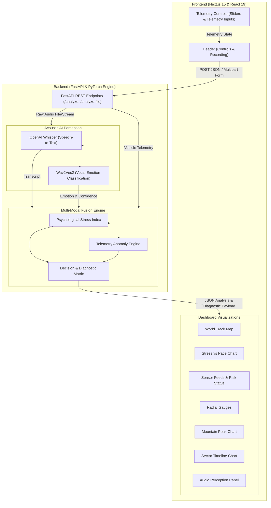
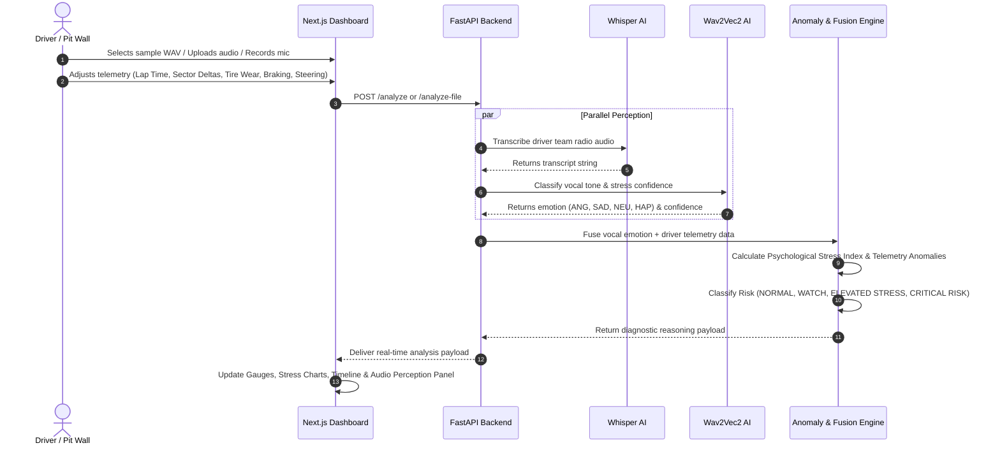
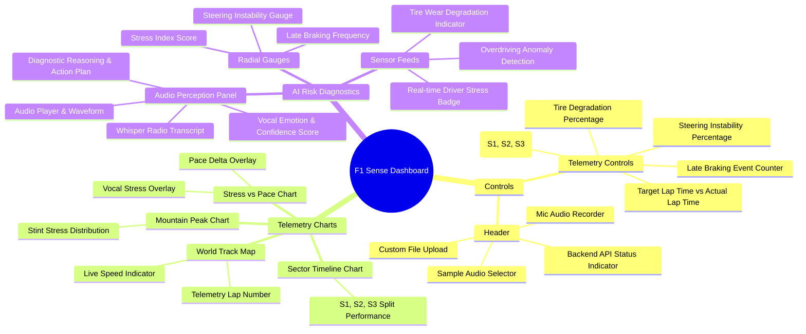

# 🏎️ F1 Sense — Telemetry & Driver Stress Perception Dashboard

**F1 Sense** is a real-time Formula 1 telemetry and driver vocal stress analysis platform. It combines raw vehicle sensor data (lap times, sector deltas, tire wear, braking late count, steering instability) with acoustic AI perception (speech transcription via OpenAI Whisper and vocal emotion classification via Wav2Vec2) to deliver immediate multi-modal risk diagnostics to race engineers.

---

## 🏗️ System Architecture



---

## 🔄 End-to-End Data & Decision Flow



---

## 🧩 Web Dashboard Component Breakdown



---

## 📁 Repository Structure

```
f1_tech/
├── backend/
│   ├── app.py          # FastAPI application & REST endpoint router
│   ├── ex.py           # ML Perception logic (Whisper, Wav2Vec2) & Anomaly Fusion Engine
│   └── goo.py          # Dataset audio extraction utility script
├── frontend/
│   ├── src/
│   │   ├── app/        # Next.js App Router (Layout & Dashboard Page)
│   │   └── components/ # Reusable UI Dashboard Components
│   └── next.config.ts  # Next.js configuration
└── test_audio_samples/ # Sample driver radio WAV audio files
```

---

## ⚡ Quick Start

### 1. Start Backend API
```bash
cd backend
pip install fastapi uvicorn torch transformers openai-whisper soundfile pydantic
python app.py
```
> The API will start at `http://localhost:8000`.

### 2. Start Frontend Web Dashboard
```bash
cd frontend
npm install
npm run dev
```
> Open `http://localhost:3000` in your browser.
